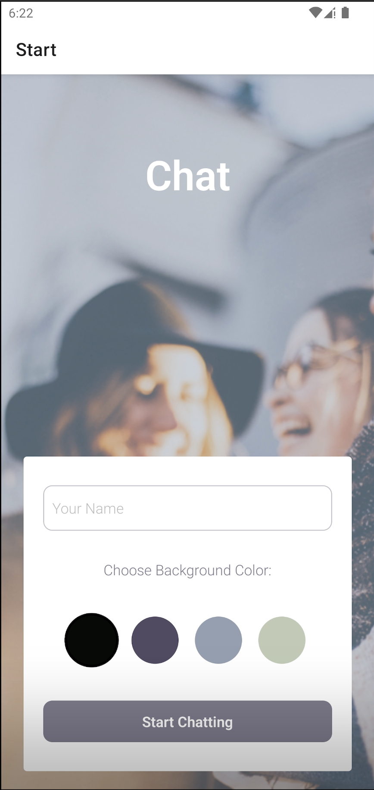

<div align="center">
  
  
</div> 

# React Native Chat App

## Project Overview

This project is a chat application built using React Native and several other libraries. The app allows users to send messages, share images, and share their location. The backend is powered by Firebase for real-time data synchronization and storage.

## Technologies Used

- **React Native**: 0.73.6
- **Expo**: ~50.0.14
- **Firebase**: ^10.3.1
- **React Navigation**: 
  - @react-navigation/native: ^6.1.17
  - @react-navigation/native-stack: ^6.9.26
- **React Native Gifted Chat**: ^2.4.0
- **React Native Maps**: 1.10.0
- **Expo Image Picker**: ~14.7.1
- **Expo Location**: ~16.5.5
- **Async Storage**: @react-native-async-storage/async-storage: 1.21.0
- **NetInfo**: @react-native-community/netinfo: 11.1.0
- **React Native Safe Area Context**: 4.8.2
- **React Native Screens**: ~3.29.0

## Prerequisites

Before you begin, ensure you have the following installed on your development machine:

- **Node.js**: 16.19.0
- **npm**: Included with Node.js installation
- **Expo CLI**: Installed globally

## Setup Instructions

### Node Version Manager (NVM)

For Mac OS users, install and set up NVM:

```
nvm install 16.19.0
nvm use 16.19.0
nvm alias default 16.19.0
```

### Expo CLI

Install the Expo CLI globally:

```
npm install -g expo-cli
```

### Expo Go App

Download the Expo Go app from the iOS App Store or Google Play Store.

### Expo Account

Create an Expo account if you don't have one already. Sign up on the [Expo website](https://expo.dev/signup).

Log in to your Expo account using the terminal:

```
expo login
```

Verify your login status:

```
expo whoami
```

## Creating the Project

Navigate to your project directory and create a new Expo project:

```
npx create-expo-app chat-app --template blank
```

### Watchman Issue

If you encounter the following error:

```
metro-file-map: Watchman crawl failed. Retrying once with node crawler.
Usually this happens when watchman isn't running. Create an empty .watchmanconfig file in your project's root folder or initialize a git or hg repository in your project.
Error: Watchman error: std::__1::system_error: open: /path/to/your/project: Operation not permitted. Make sure watchman is running for this project. See Watchman Troubleshooting.
```

Resolve it by restarting Watchman:

```
watchman shutdown-server
```

Run your React Native project again and grant Watchman the necessary permissions.

## Navigating Between Screens

To set up navigation in your project, install the necessary packages:

```
npm install --save @react-navigation/native @react-navigation/native-stack
expo install react-native-screens react-native-safe-area-context
```

## Project Structure

Create a `components` folder in the root directory of your project. Place all your components in this folder.

## Firebase Setup

Initialize Firebase in your project. Refer to the Firebase documentation for instructions on setting up Firebase for your platform.

## Running the App

Start the Expo development server:

```
expo start
```

Scan the QR code with the Expo Go app on your device to view the app.